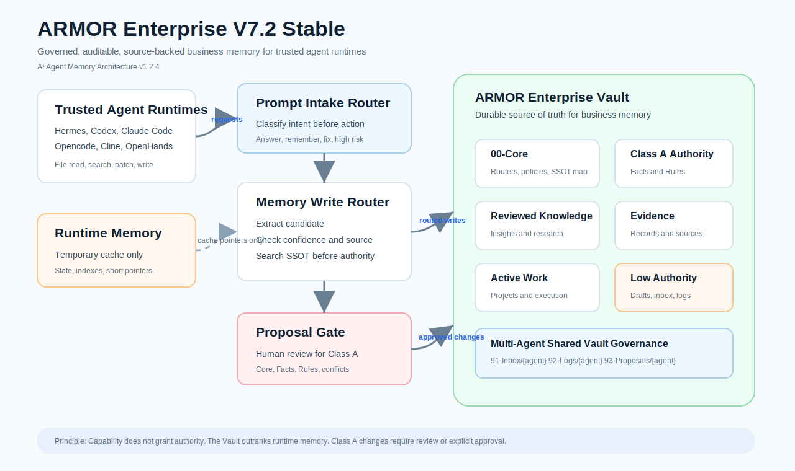
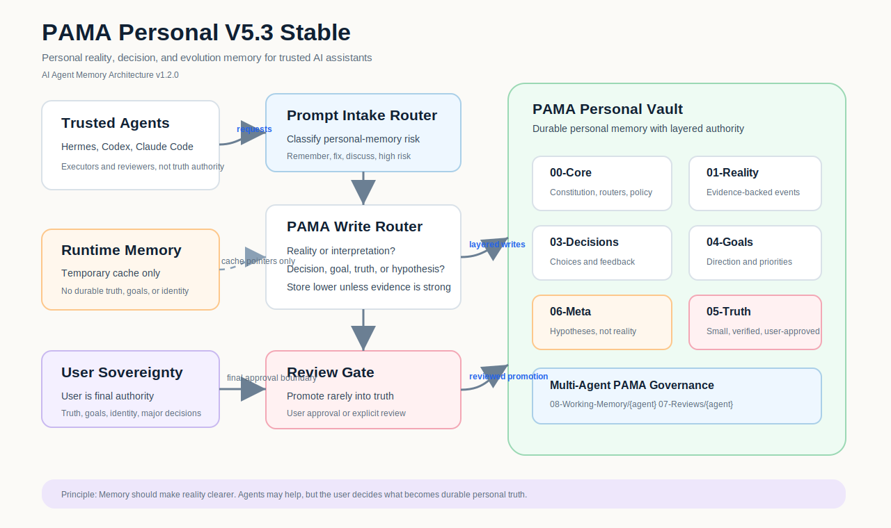

# AI Agent Memory Architecture v1.2.0

> Long-term, auditable, and governed memory architectures for AI workspaces.  
> 面向 AI 工作空间的长期、可审计、可治理记忆架构。

[English](#english) | [中文](#中文)

---

## English

AI Agent Memory Architecture is a Markdown/Obsidian-based specification for building durable memory systems for AI agents. It treats memory as a governed knowledge operating system rather than a loose folder, vector-store dump, runtime cache, or prompt extension.

The goal is not to remember everything. The goal is to preserve only memory that is useful, source-backed, reviewable, retrievable, and honest about its authority.

**Project version:** v1.2.0

### Architecture Branches

| Branch | Version | Scenario | Status |
| --- | --- | --- | --- |
| [ARMOR Enterprise AI Workspace](enterprise/README.md) | V7.2 Stable | Teams, business operations, brand/product/customer knowledge, multi-agent workspaces | Stable |
| [PAMA Personal AI Memory Architecture](personal/README.md) | V5.3 Stable | Individual knowledge, decision review, attention auditing, personal reality tracking | Stable |

Runtime note: This project has no dependency on UI-side Obsidian executor plugins. Trusted agent runtimes such as Hermes, Claude Code, Codex, Opencode, Cline, OpenHands, and custom agents can operate the Vault directly when they follow the routers, permission rules, retrieval policy, and proposal workflow.

### Architecture Diagrams

#### ARMOR Enterprise V7.2 Stable



#### PAMA Personal V5.3 Stable



### Branch Overview

#### ARMOR Enterprise AI Workspace

ARMOR is designed for business-critical AI memory. It introduces Single Source of Truth (SSOT), permission classes, proposal-based review, source-based confidence labels, lifecycle rules, retrieval filters, schema validation, and low-maintenance operations.

Use it when a team needs AI agents to manage brand facts, product specs, customer profiles, SOPs, meeting records, research, and project knowledge without letting unreviewed notes become current truth.

#### PAMA Personal AI Memory Architecture

PAMA is designed for a single human user. It focuses on reality tracking, attention auditing, decision review, goal management, and carefully promoted personal truth. Its purpose is to help an AI assistant preserve high-fidelity long-term memory without amplifying self-deception, short-term impulses, or false certainty.

### Core Ideas

- **Reality > Narrative**: memory must follow evidence, not comforting stories.
- **Behavior > Declarations**: stated priorities are checked against actual attention, decisions, and outcomes.
- **Store lower when uncertain**: uncertain information belongs in drafts, working memory, records, or research, not in authoritative facts.
- **Capture is not authority**: agents may capture quickly, but only governed review can promote memory into truth-bearing layers.
- **Conservative retrieval**: drafts, logs, raw records, inboxes, proposals, and archives are excluded from default truth retrieval.
- **Runtime memory is not long-term memory**: runtime databases, embeddings, and indexes are infrastructure only.

### Shared Governance Pattern

The enterprise and personal editions use different domain names, but they share the same governance pattern:

| Layer Type | Enterprise Example | Personal Example | Purpose |
| --- | --- | --- | --- |
| Core governance | `00-Core/` | `00-Core/` | Constitution, operating protocol, permission and retrieval rules |
| Authoritative truth | `01-Facts/`, `02-Rules/` | `01-Reality/`, `05-Truth/` | Stable facts, rules, evidence-backed reality, durable principles |
| Validated learning | `03-Insights/` | `03-Decisions/`, `07-Reviews/` | Cases, lessons, reviews, decision feedback |
| External or uncertain knowledge | `04-Research/` | `06-Meta/` | Research, hypotheses, decaying assumptions |
| Active work | `05-Projects/` | `04-Goals/`, `08-Working-Memory/` | Current execution, goals, drafts, short-term workspace |
| Evidence | `06-Records/` | `01-Reality/` records | Raw source material; evidence is not automatically fact |
| Operations | `70-Schemas/`, `80-Indexes/`, `81-Dashboards/` | deployment templates and review files | Validation, navigation, audits, dashboards |
| Low-authority capture | `90-Drafts/`, `91-Inbox/`, `92-Logs/`, `93-Proposals/` | `08-Working-Memory/` | Fast capture, pending review, no default truth authority |
| Cold storage | `99-Archive/` | `99-Archive/` | Deprecated, expired, superseded, or explicitly recalled history |

Top-level vault structure is treated as a frozen architecture boundary. Domain-specific subfolders may grow, but agents should not invent or merge top-level layers without explicit human approval.

### Memory Promotion Pipeline

```text
Conversation / raw input
        |
        v
Low-authority capture
Working memory / records / drafts / inbox / research inbox
        |
        v
Evidence check + review cycle + proposal when needed
        |
        v
Human approval for high-authority or high-risk changes
        |
        v
Authoritative memory
Facts / rules / truth / validated insights / reviewed research
```

### Agent Runtime Integration

This project separates memory governance from agent execution.

ARMOR and PAMA define where memory belongs, what authority it has, how it is promoted, and what must be excluded from default truth retrieval. Runtime tools such as Hermes, Claude Code, Codex, Opencode, MCP servers, embeddings, and local indexes may help agents operate on a Vault, but they do not become sources of truth.

Runtime principle:

```text
Tools provide capability.
The architecture defines permission.
The Vault remains the durable memory system.
```

### Quick Start

1. Choose the architecture branch that matches your use case: [Enterprise](enterprise/README.md) or [Personal](personal/README.md).
2. Create an Obsidian Vault or trusted Markdown directory using the branch's frozen top-level structure.
3. Add the required core files, schemas, templates, retrieval rules, and permission rules.
4. Point your AI agent's long-term memory path to the vault.
5. Keep runtime databases, embeddings, and indexes as runtime infrastructure only.
6. Let the agent capture freely into low-authority layers, then promote only source-backed, reviewed memory into authoritative layers.

### Installation

Copy this prompt to your AI agent. It will install the default enterprise ARMOR architecture into your chosen Obsidian Vault or Markdown directory:

```text
Please read and execute AGENT_INSTALL.md from this repository:
https://github.com/licat233/AI-Agent-Memory-Architecture

Help me install AI Agent Memory Architecture.
Install the default enterprise/ARMOR version.
Target Vault path: <paste your Vault or Markdown directory path here>
Do not install any Obsidian UI plugin.
Do not use runtime memory as long-term memory.
Create missing Vault folders, copy missing core documents, preserve existing files, write an installation log, and run the validation checklist.
```

### Documentation

| Document | Description |
| --- | --- |
| [Agent Installation Guide](AGENT_INSTALL.md) | Instructions an AI agent can follow to install ARMOR or PAMA into a Vault |
| [Enterprise README](enterprise/README.md) | Enterprise overview, ARMOR quick start, permission model, lifecycle rules |
| [ARMOR V7.2 Stable](enterprise/V7_2_Stable.md) | Full enterprise architecture specification |
| [ARMOR V7.1.5 Governance Patch](enterprise/V7_1_5_Governance_Patch.md) | Governance layer carried forward into V7.2: confidence labels, fact creation gate, write quality rules |
| [ARMOR Prompt Intake Router](enterprise/Prompt_Intake_Router.md) | First-layer intent router for ambiguous or high-risk prompts |
| [ARMOR Memory Write Router](enterprise/Memory_Write_Router.md) | Mandatory routing rules for user-requested permanent memory |
| [ARMOR Root-Cause Fix Protocol](enterprise/Root_Cause_Fix_Protocol.md) | Mandatory protocol for fixing errors at their source layer |
| [ARMOR Runtime Memory Policy](enterprise/Runtime_Memory_Policy.md) | Enterprise policy for keeping runtime memory low-authority and temporary |
| [Agent Runtime Adaptation Guide](enterprise/agent_runtime_adaptation_guide.md) | How to adapt any trusted agent runtime to ARMOR |
| [Multi-Agent Shared Vault Governance](enterprise/multi_agent_shared_vault_governance.md) | How Hermes, Codex, Claude Code, and other agents can safely share one ARMOR Vault |
| [Personal README](personal/README.md) | PAMA overview, personal vault layers, promotion rules |
| [PAMA V5.3 Stable](personal/PAMA%20V5.3%20Stable.md) | Full personal architecture specification |
| [PAMA Constitution](personal/PAMA%20Constitution%20v1.0.md) | Highest-level personal architecture charter |
| [PAMA Deployment Spec](personal/PAMA-Deployment-Spec-v1.0.md.md) | Personal vault implementation and metadata rules |
| [PAMA Prompt Intake Router](personal/PAMA_Prompt_Intake_Router.md) | First-layer intent router for ambiguous or high-risk prompts |
| [PAMA Memory Write Router](personal/PAMA_Memory_Write_Router.md) | Mandatory routing rules for user-requested permanent memory |
| [PAMA Root-Cause Fix Protocol](personal/PAMA_Root_Cause_Fix_Protocol.md) | Mandatory protocol for fixing errors at their source layer |
| [PAMA Runtime Memory Policy](personal/PAMA_Runtime_Memory_Policy.md) | Personal policy for keeping runtime memory temporary and low-authority |
| [PAMA Multi-Agent Shared Vault Governance](personal/PAMA_Multi_Agent_Shared_Vault_Governance.md) | How multiple trusted agents can safely share one PAMA Vault |

---

## 中文

AI Agent Memory Architecture 是一套基于 Markdown / Obsidian Vault 的 AI 智能体长期记忆架构规范。它不把记忆当作松散文件夹、向量库堆料、运行时缓存或超长 Prompt，而是把记忆视为一套可治理的知识操作系统。

记忆系统的目标不是记住一切，而是只保留有用、有来源、可复核、可检索，并且诚实标注自身权威等级的记忆。

**项目版本：** v1.2.0

### 架构分支

| 分支 | 版本 | 场景 | 状态 |
| --- | --- | --- | --- |
| [ARMOR 企业级 AI 工作空间](enterprise/README.md) | V7.2 Stable | 团队、业务运营、品牌/产品/客户知识、多智能体工作区 | 稳定 |
| [PAMA 个人 AI 记忆架构](personal/README.md) | V5.3 Stable | 个人知识、决策复盘、注意力审计、现实追踪 | 稳定 |

运行时说明：本项目不依赖 Obsidian UI 侧执行插件。Hermes、Claude Code、Codex、Opencode、Cline、OpenHands 及自定义智能体等受信任运行时只要遵循路由器、权限规则、检索策略和提案工作流，即可直接操作 Vault。

### 架构图

#### ARMOR Enterprise V7.2 Stable


#### PAMA Personal V5.3 Stable


### 分支概览

#### ARMOR 企业级 AI 工作空间

ARMOR 面向业务关键场景的 AI 记忆系统。它引入唯一事实源（SSOT）、权限分级、提案人审、基于来源的置信度标签、生命周期规则、检索过滤、Schema 校验和低维护运营机制。

当团队需要 AI 智能体管理品牌事实、产品参数、客户画像、SOP、会议记录、研究资料和项目知识，同时又不能让未经审查的笔记污染当前事实时，应使用 ARMOR。

#### PAMA 个人 AI 记忆架构

PAMA 面向单个个人用户。它关注现实追踪、注意力审计、决策复盘、目标管理和谨慎晋升的个人真理。它的目标是让 AI 助手保存高保真的长期记忆，同时避免放大自我欺骗、短期冲动和虚假确定性。

### 核心思想

- **现实优先于叙事**：记忆必须服从证据，而不是服务于令人舒服的故事。
- **行为胜过宣告**：口头目标需要被真实注意力、决策和结果校验。
- **不确定则向低权层保存**：不确定信息应进入草稿、工作记忆、记录或研究层，而不是直接成为权威事实。
- **捕获不等于授权**：智能体可以快速捕获，但只有经过治理和复核的信息才能晋升为长期真相。
- **默认保守检索**：草稿、日志、原始记录、收件箱、提案和归档默认不得作为当前事实参与检索。
- **运行时记忆不是长期记忆**：运行时数据库、Embedding 和索引只属于基础设施。

### 共享治理模式

企业版与个人版使用不同领域命名，但共享同一种治理模式：

| 层级类型 | 企业版示例 | 个人版示例 | 用途 |
| --- | --- | --- | --- |
| 核心治理 | `00-Core/` | `00-Core/` | 宪法、运行协议、权限规则、检索规则 |
| 权威真相 | `01-Facts/`, `02-Rules/` | `01-Reality/`, `05-Truth/` | 稳定事实、规则、证据支撑的现实、长期原则 |
| 验证经验 | `03-Insights/` | `03-Decisions/`, `07-Reviews/` | 案例、教训、复盘、决策反馈 |
| 外部或不确定知识 | `04-Research/` | `06-Meta/` | 研究、假设、会衰减的推断 |
| 活动工作 | `05-Projects/` | `04-Goals/`, `08-Working-Memory/` | 当前执行、目标、草稿、短期工作区 |
| 原始证据 | `06-Records/` | `01-Reality/` 记录 | 原始来源材料；证据不自动等于事实 |
| 运维设施 | `70-Schemas/`, `80-Indexes/`, `81-Dashboards/` | 部署模板与复盘文件 | 校验、导航、审计、仪表盘 |
| 低权捕获 | `90-Drafts/`, `91-Inbox/`, `92-Logs/`, `93-Proposals/` | `08-Working-Memory/` | 快速捕获、待审查、默认无真相权威 |
| 冷归档 | `99-Archive/` | `99-Archive/` | 失效、过期、被推翻或仅显式召回的历史 |

顶层 Vault 目录属于冻结架构边界。领域子目录可以扩展，但 AI 智能体不得在没有人类明确授权的情况下新增、合并或重命名顶层层级。

### 记忆晋升流水线

```text
会话 / 原始输入
        |
        v
低权捕获
工作记忆 / 原始记录 / 草稿 / 收件箱 / 研究收件箱
        |
        v
证据检查 + 周期复盘 + 必要时生成提案
        |
        v
高权或高风险变更由人类审批
        |
        v
权威记忆
事实 / 规则 / 真理 / 已验证洞察 / 已审查研究
```

### 智能体运行时集成

本项目将记忆治理和智能体执行能力分离。

ARMOR 与 PAMA 定义记忆应该存在哪里、具有什么权威、如何晋升，以及哪些内容不得进入默认真相检索。Hermes、Claude Code、Codex、Opencode、MCP servers、Embedding 和本地索引等运行时工具可以帮助智能体操作 Vault，但它们本身不是事实源。

运行时原则：

```text
工具提供能力。
架构定义权限。
Vault 保持为持久记忆系统。
```

### 快速开始

1. 根据使用场景选择架构分支：[企业版](enterprise/README.md) 或 [个人版](personal/README.md)。
2. 在 Obsidian Vault 或可信 Markdown 目录中创建对应分支的冻结顶层结构。
3. 添加必要的核心文件、Schema、模板、检索规则和权限规则。
4. 将 AI 智能体的长期记忆路径指向该 Vault。
5. 运行时数据库、Embedding 和索引只作为运行基础设施使用。
6. 允许智能体自由写入低权层，再将有来源、经复核的信息晋升到权威层。

### 安装教程

复制下面这段内容给你的 AI Agent，它会把默认企业版 ARMOR 架构安装到你指定的 Obsidian Vault 或 Markdown 目录：

```text
请阅读并执行这个仓库里的 AGENT_INSTALL.md：
https://github.com/licat233/AI-Agent-Memory-Architecture

请帮我安装 AI Agent Memory Architecture。
安装默认 enterprise/ARMOR 版本。
目标 Vault 路径：<在这里粘贴你的 Vault 或 Markdown 目录路径>
不要安装任何 Obsidian UI 插件。
不要把 runtime memory 当作长期记忆。
请创建缺失的 Vault 目录、复制缺失的核心架构文档、保留已有文件、写入安装日志，并执行验证清单。
```

### 文档索引

| 文档 | 说明 |
| --- | --- |
| [Agent 安装指南](AGENT_INSTALL.md) | AI Agent 可直接执行的 ARMOR/PAMA Vault 安装说明 |
| [企业版 README](enterprise/README.md) | 企业版总览、ARMOR 快速开始、权限模型、生命周期规则 |
| [ARMOR V7.2 Stable](enterprise/V7_2_Stable.md) | 企业级完整架构规范 |
| [ARMOR V7.1.5 Governance Patch](enterprise/V7_1_5_Governance_Patch.md) | 已并入 V7.2 的治理层：置信度标签、事实创建门禁、写入质量规则 |
| [ARMOR Prompt Intake Router](enterprise/Prompt_Intake_Router.md) | 用于模糊或高风险 prompt 的第一入口意图路由器 |
| [ARMOR Memory Write Router](enterprise/Memory_Write_Router.md) | 用户明确要求长期记忆时的强制写入路由规则 |
| [ARMOR Root-Cause Fix Protocol](enterprise/Root_Cause_Fix_Protocol.md) | 错误必须在源头层级修复的强制协议 |
| [ARMOR Runtime Memory Policy](enterprise/Runtime_Memory_Policy.md) | 运行时 memory 必须保持低权威和临时性的企业策略 |
| [智能体运行时适配指南](enterprise/agent_runtime_adaptation_guide.md) | 任意可信智能体运行时如何接入 ARMOR |
| [多智能体共享 Vault 治理](enterprise/multi_agent_shared_vault_governance.md) | Hermes、Codex、Claude Code 等多个 agent 如何安全共享一个 ARMOR Vault |
| [个人版 README](personal/README.md) | PAMA 总览、个人 Vault 层级、记忆晋升规则 |
| [PAMA V5.3 Stable](personal/PAMA%20V5.3%20Stable.md) | 个人版完整架构规范 |
| [PAMA 宪法](personal/PAMA%20Constitution%20v1.0.md) | 个人版最高治理章程 |
| [PAMA 部署规范](personal/PAMA-Deployment-Spec-v1.0.md.md) | 个人 Vault 落地与元数据规则 |
| [PAMA Prompt Intake Router](personal/PAMA_Prompt_Intake_Router.md) | 用于模糊或高风险 prompt 的第一入口意图路由器 |
| [PAMA Memory Write Router](personal/PAMA_Memory_Write_Router.md) | 用户明确要求长期记忆时的强制写入路由规则 |
| [PAMA Root-Cause Fix Protocol](personal/PAMA_Root_Cause_Fix_Protocol.md) | 错误必须在源头层级修复的强制协议 |
| [PAMA Runtime Memory Policy](personal/PAMA_Runtime_Memory_Policy.md) | 运行时 memory 必须保持临时和低权威的个人策略 |
| [PAMA 多智能体共享 Vault 治理](personal/PAMA_Multi_Agent_Shared_Vault_Governance.md) | 多个可信 agent 如何安全共享一个 PAMA Vault |
